# ⚡ Craicek Workflow
> **The Context-Optimized Protocol for AI Assisted Development**

[](https://opensource.org/licenses/MIT)
[](https://anthropic.com)

Il **Craicek Workflow** è un protocollo operativo progettato per sviluppatori che praticano il "Vibecoding" (sviluppo assistito da AI). Risolve il problema della memoria limitata degli LLM, riduce drasticamente il consumo di token e garantisce continuità perfetta tra sessioni di lavoro distinte.

---

## 🛑 Il Problema
Lavorare con AI Agent (come Claude Code, Cursor, Windsurf) presenta tre colli di bottiglia critici:

1. **Amnesia da Sessione:** Quando chiudi il terminale, l'AI dimentica cosa stavi facendo.
2. **Spreco di Token:** Per "ricordare" il contesto, spesso si ricaricano interi file di progetto, consumando il 20-30% della context window prima ancora di iniziare.
3. **Degrado Cognitivo:** Più lunga è la chat, più l'AI diventa confusa ("Allucinazioni da contesto pieno").

## 🟢 La Soluzione: Context Isolation
Il Craicek Workflow introduce il concetto di **"RAM Esterna Persistente"**.
Invece di caricare tutto il progetto, l'AI legge e scrive su un singolo file volatile (`00_CONTEXT.md`) che funge da "salvataggio di stato", mentre mantiene la conoscenza storica in file di archivio che vengono consultati solo *on-demand*.

### I Risultati
- **📉 -80% Token Usage** all'avvio della sessione.
- **🧠 Zero Allucinazioni** grazie al reset forzato del contesto.
- **🚀 Handover Perfetto**: Riprendi il lavoro mesi dopo sapendo esattamente file e riga dove eri rimasto.

---

## 📂 Architettura dei File
Il sistema si basa su una cartella `/docs` strutturata gerarchicamente:

```text
/docs
  ├── 00_CONTEXT.md        # [RAM] Il file VOLATILE. L'unico letto all'avvio.
  ├── 01_SPECS.md          # [ROM] Specifiche del progetto (Read-Only).
  ├── 02_RULES.md          # [ROM] Tech Stack e Regole di Coding (Read-Only).
  ├── 10_ROADMAP.md        # [DB]  Lista Task e Storico avanzamento.
  ├── 20_MEMORY.md         # [LOG] Errori noti e lezioni apprese (Append-Only).
  ├── 30_QA.md             # [TEST] Piani di test e regressione.
  └── Craicek_protocol.md  # [KERNEL] Le istruzioni per l'AI su come usare questi file.
```

---

## 🔄 Il Flusso di Lavoro (The Loop)

```mermaid
graph TD
    A[🚀 START] -->|Legge solo 00_CONTEXT| B(Fase 1: BOOT)
    B --> C{Task Chiaro?}
    C -- No --> D[Consulta RULES/SPECS]
    C -- Si --> E[⚡ FASE 2: VIBECODING]
    E --> F[Scrive Codice & Fix]
    F --> G{Token > 50% o STOP?}
    G -- Si --> H(FASE 4: HANDOVER)
    G -- No --> I{Task Finito?}
    I -- No --> E
    I -- Si --> L[FASE 3: QA & UPDATE]
    L --> H
    H -->|Pulisce 00_CONTEXT| M[💾 END SESSION]
```



### 1. Boot (Avvio Chirurgico)
Non dire all'AI "Ecco il progetto". Dille: *"Leggi `00_CONTEXT.md` e dimmi cosa fare."*
L'AI leggerà solo pochi byte: *"Obiettivo: Fix API Login. File aperto: auth.ts riga 40."*

### 2. Vibecoding (Esecuzione)
Sviluppo rapido. Se l'AI sbaglia stack tecnologico, la correggi e la obblighi a scrivere l'errore in `20_MEMORY.md`.

### 3. Handover (Il Segreto)
Prima di chiudere, l'AI deve:
1. Aggiornare la Roadmap (se il task è finito).
2. **Riscrivere `00_CONTEXT.md`**: Cancellare tutto e lasciare solo lo snapshot per il "Te del futuro".

---

## 🚀 Quick Start

### 🍎🐧 Mac / Linux / WSL
Esegui questo script nella root del tuo progetto:

```bash
curl -sL [https://raw.githubusercontent.com/BitMakerMan/Craicek_workflow/main/init_craicek.sh](https://raw.githubusercontent.com/BitMakerMan/Craicek_workflow/main/init_craicek.sh) | bash
```

### 🪟 Windows (PowerShell)
Scarica il file `init_craicek_win.ps1` nella root del progetto, poi:
1. Tasto destro sul file scaricato.
2. Seleziona **"Esegui con PowerShell"**.

*(Oppure apri un terminale nella cartella ed esegui: `.\init_craicek_win.ps1`)*

---

## 💬 Prompts per l'AI

Copia e incolla questi comandi nel tuo LLM (Claude, ChatGPT, etc).

### 🟢 Start Session
```text
Attiva Craicek Protocol.
Leggi docs/Craicek_protocol.md e poi esegui il boot leggendo docs/00_CONTEXT.md.
Dimmi qual è il nostro obiettivo per questa sessione e qual è il primo step pratico.
```

### 🔴 End Session (Handover)
```text
STOP. Esegui la fase di Handover.
1. Se il task è finito, aggiorna ROADMAP e QA.
2. Se abbiamo imparato lezioni critiche, scrivile in MEMORY.
3. FONDAMENTALE: Resetta docs/00_CONTEXT.md. Scrivi esattamente nome file, riga e prossimo micro-step per la prossima sessione.
4. Chiudi.
```

---

## ⚖️ Vantaggi e Svantaggi

| ✅ PRO | ❌ CONTRO |
|--------|-----------|
| **Risparmio Economico**: Meno token usati per input = meno costi API. | **Disciplina**: Richiede rigore nel lanciare il prompt di chiusura. |
| **Focus Assoluto**: L'AI non si distrae con file inutili. | **Setup Iniziale**: Bisogna creare i 6 file (lo script lo fa per te). |
| **Continuità**: Puoi riprendere un progetto dopo 6 mesi in 30 secondi. | **Overhead**: Per task minuscoli (1 min) può sembrare eccessivo. |
| **Qualità**: Il file `MEMORY.md` previene la ripetizione degli errori. | |

---

## 🤝 Contribuire
Questo è un metodo agnostico rispetto al linguaggio e all'IDE. Sentiti libero di fare fork, adattare i template e migliorare lo script di automazione.

**Created for the Vibecoding Era.**
